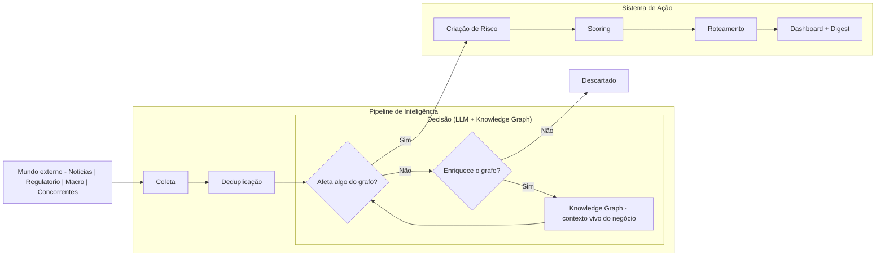

# Risk Management — Visão Geral

Este documento apresenta uma visão macro do sistema de Risk Management: o que ele faz, por que foi construído dessa forma e como as peças se encaixam. Para a especificação técnica completa, consulte `knowledge-graph.md`.

---

## O problema

Acompanhar riscos para uma base de clientes distribuída em múltiplos setores é um trabalho contínuo e de alto volume. Notícias, publicações regulatórias, variações macroeconômicas e movimentações de concorrentes geram dezenas de sinais por dia — a maioria irrelevante, mas alguns críticos. O desafio não é capturar mais informação: é identificar, dentre tudo que acontece, o que de fato ameaça os clientes e precisa de atenção agora.

---

## O que o sistema faz

O Risk Management é um sistema de inteligência contínua que monitora o ambiente externo e transforma eventos relevantes em alertas acionáveis, roteados para as pessoas certas no momento certo.

Ele faz isso em três movimentos:

**Monitora** — coleta informações de fontes abertas em tempo real: notícias de mercado, publicações do Diário Oficial, indicadores do Banco Central e IBGE, e movimentações de concorrentes.

**Classifica** — usa um modelo de linguagem que conhece o contexto do negócio — quem são os clientes, em quais setores atuam, quais contratos estão vigentes — para decidir se uma informação representa um risco real. Só o que é relevante entra no sistema.

**Alerta** — quando um risco é identificado, ele é pontuado por severidade, vinculado aos clientes afetados e roteado ao responsável correto. O time vê os riscos priorizados no dashboard e recebe um digest diário por email.

---

## A decisão arquitetural central

O sistema foi construído em torno de um **Knowledge Graph** em vez de um banco de dados tradicional. Essa escolha tem uma razão direta: riscos não existem de forma isolada — eles afetam clientes que têm contratos, que pertencem a setores, que competem com concorrentes expostos a variáveis macro. Um grafo representa essas relações nativamente.

O ponto mais importante da arquitetura é que **o modelo de linguagem e o grafo rodam juntos**. O modelo não classifica conteúdo no vácuo: ele consulta o grafo antes de decidir, sabendo exatamente quem são os clientes e qual é o contexto do negócio. Isso significa que a classificação é precisa desde o início e fica mais precisa com o tempo, à medida que o grafo cresce.

Nada é armazenado antes de ser classificado. Conteúdo que não representa risco nem enriquece o grafo é descartado na hora — sem acúmulo de dados sem valor.

---

## Fluxo de decisão do sistema

O fluxo abaixo mostra como o sistema toma decisões: todo conteúdo que entra é forçado a passar por um funil binário — virar risco, enriquecer o grafo ou ser descartado.

---

## As quatro camadas

Fontes externas → Pipeline de classificação → Knowledge Graph → Output

**Fontes** — Notícias, regulatório, macro e concorrentes. Cada categoria tem seu conector próprio (RSS, scraper ou API).

**Pipeline** — Deduplicação para não processar o mesmo conteúdo duas vezes, seguida de classificação com contexto do grafo. O resultado é binário: ou entra no grafo como risco (ou enriquecimento de entidade), ou é descartado.

**Knowledge Graph** — O núcleo do sistema. Representa clientes, contratos, setores, concorrentes e variáveis macro como entidades conectadas. É consultado em tempo real durante a classificação, garantindo decisões contextualizadas.

**Output** — Scoring automático, roteamento para o responsável correto e dashboard com digest diário. É a camada onde o sistema gera valor direto para o time.

---

## O que o time ganha

- Visibilidade antecipada sobre riscos regulatórios, macroeconômicos e competitivos antes que afetem os clientes
- Alertas priorizados por severidade e roteados para a pessoa certa, sem ruído
- Histórico completo de exposição de cada cliente ao longo do tempo
- Um grafo que fica mais inteligente com o uso — cada novo cliente, setor ou concorrente cadastrado melhora a precisão da classificação de conteúdos futuros
